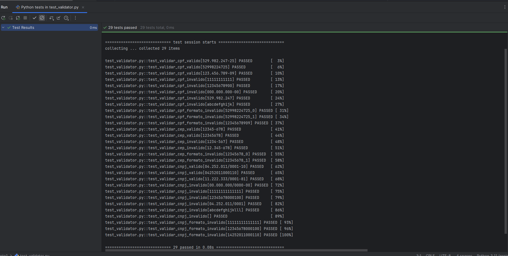

# Projeto de Validação com Pytest


Este projeto contém funções em Python com testes automatizados usando **Pytest** e integração contínua via **GitHub Actions**.

---

## 🚀 Funcionalidades

- Validação de CPF
- Validação de CEP
- Validação de CNPJ (em breve)
- Cálculos matemáticos (soma, subtração, divisão e multiplicação)
- Cálculo de desconto
- FizzBuzz com TDD

---

## 🧪 Testes

Os testes são escritos com [Pytest](https://docs.pytest.org/) e são executados automaticamente no GitHub Actions a cada `push` na branch `master`.

### ✅ Rodar os testes localmente:



```bash
pip install -r requirements.txt
pytest 

